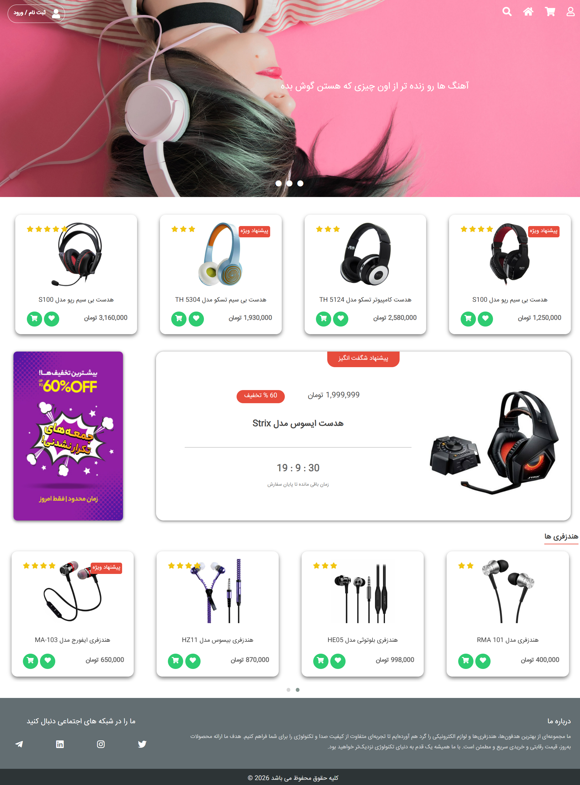
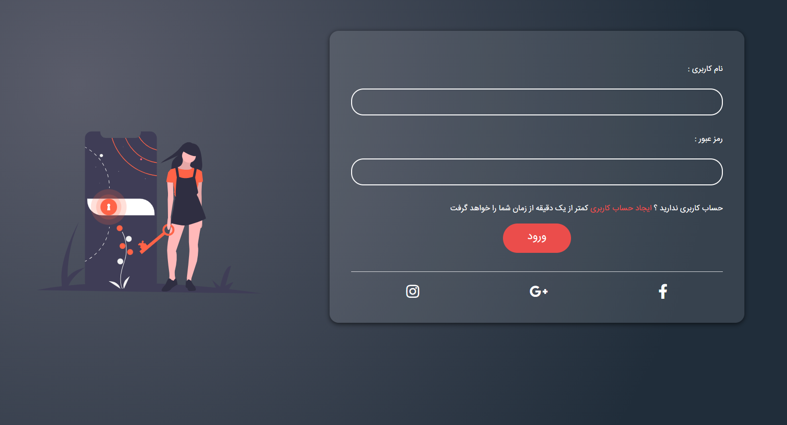

📌 Overview:
A simple Ecommerce website frontend project built using HTML, CSS, and JavaScript

🚀 Features:
Responsive design for mobile and desktop
Product listing page
Login page UI
Image carousel (Owl Carousel)
Interactive UI elements using JavaScript
Clean and structured layout

🛠️ Technologies:
HTML5
CSS3
JavaScript (Vanilla)
Font Awesome (Icons)
Owl Carousel
Animate.css (Slider animation)

📸 Preview:
Home Page:

Login Page:

👨‍💻 Author:
Name: Nariman Hasanpanah, 
GitHub: https://github.com/Nariman-Hasanpanah, 
Project Type: Frontend Practice Project
